# 🚀 VPC Peering Project 🚀

## Overview

This project guides you through setting up **VPC Peering** between two Virtual Private Clouds (VPCs) in AWS. Establishing VPC Peering creates a **secure, private connection** for seamless communication between the VPCs, enhancing network segmentation and security within your AWS environment.

---

## 🎯 Objectives

1. **Create and configure multiple VPCs.**
2. **Establish a VPC Peering Connection** to enable communication between isolated VPCs.
3. **Configure Route Tables** to route traffic between peered VPCs.
4. **Test Peering Connectivity** to ensure successful setup.

---

## 🛠 Prerequisites

- **AWS Account** (Free tier is sufficient)
- Basic knowledge of **VPCs, subnets, and route tables**
- Familiarity with the **AWS Management Console**

---

## 🧩 Setup Guide

### Step 1: Create VPCs

Create two VPCs with **unique CIDR blocks**. Configure subnets and routing within each VPC.

1. **Create VPC 1**
   - Set up subnets and configure routing.

2. **Create VPC 2**
   - Set up subnets and configure routing.

---

### Step 2: Set Up VPC Peering

1. **Request VPC Peering Connection**
   - Initiate a peering connection request from **VPC 1**.

2. **Accept Peering Connection**
   - Accept the peering request in **VPC 2**.

---

### Step 3: Configure Route Tables

Update the route tables in each VPC to allow traffic to flow between them.

1. **Update Route Table for VPC 1**
   - Add a route to direct traffic to **VPC 2**.

2. **Update Route Table for VPC 2**
   - Add a route to direct traffic to **VPC 1**.

---

### Step 4: Test Connectivity

1. **Launch EC2 Instances**
   - Launch an instance in each VPC.

2. **Test Connectivity**
   - Test network connectivity (e.g., ping) between the instances to confirm successful peering.

---

## 🎮 Project Modes

1. **Guided Mode**: Follow step-by-step instructions.
2. **Explorer Mode**: Experiment with configurations and dive deeper into VPC Peering.

---

## 📚 Resources

- [AWS Documentation on VPC Peering](https://docs.aws.amazon.com/vpc/latest/peering/what-is-vpc-peering.html)
- [AWS VPC Peering User Guide](https://docs.aws.amazon.com/vpc/latest/peering/)

---

## Happy Peering! 🌐

### Project Flow

```mermaid
flowchart TD
    Start[Project Initialization] --> VPC1[Create VPC 1]
    Start --> VPC2[Create VPC 2]
    VPC1 --> Subnet1[Configure Subnets & Routing for VPC 1]
    VPC2 --> Subnet2[Configure Subnets & Routing for VPC 2]
    Subnet1 --> Peering1[Request Peering Connection]
    Subnet2 --> Peering2[Accept Peering Connection]
    Peering1 --> Route1[Update Route Table for VPC 1]
    Peering2 --> Route2[Update Route Table for VPC 2]
    Route1 --> Connectivity[Test Connectivity Between Instances]
    Connectivity --> Complete[Project Complete! 🎉]
    Complete --> Cleanup[Optional: Clean Up Resources]
```

