# VPC Peering Project 🚀 

Welcome to the **VPC Peering Project**! In this project, we're taking a big step forward by setting up VPC Peering, connecting TWO VPCs instead of just one. This project will help you revise and solidify your previous knowledge in a new and exciting scenario.

## Table of Contents

- [Introduction](#introduction)
- [Project Overview](#project-overview)
- [Prerequisites](#prerequisites)
- [Setup Guide](#setup-guide)
  - [Step 1: Create VPCs](#step-1-create-vpcs)
  - [Step 2: Set Up VPC Peering](#step-2-set-up-vpc-peering)
  - [Step 3: Configure Route Tables](#step-3-configure-route-tables)
  - [Step 4: Test Connectivity](#step-4-test-connectivity)
- [Project Modes](#project-modes)
- [Resources](#resources)

## Introduction

In this project, you'll get hands-on experience with setting up VPC Peering between two Virtual Private Clouds (VPCs). This will enhance your understanding of network segmentation, security, and connectivity within the AWS environment.

## Project Overview

### Objectives

- ☁️ Set up multiple VPCs.
- 🌉 Create a VPC peering connection to enable communication between two VPCs.
- 👩‍🔬 Test VPC peering with connectivity tests.

## Prerequisites

Before you start, ensure you have:

- An AWS account.
- Basic knowledge of VPCs, subnets, and route tables.
- Familiarity with the AWS Management Console.

## Setup Guide

### Step 1: Create VPCs

First, we'll create two VPCs to be connected via VPC Peering.
 - Create VPC 1 → Configure Subnets & Routing for VPC 1
 - Create VPC 2 → Configure Subnets & Routing for VPC 2

```mermaid
flowchart TD
    Start[Start Project] --> VPC1[Create VPC 1]
    VPC1 --> Subnet1[Configure Subnets & Routing for VPC 1]
    Start --> VPC2[Create VPC 2]
    VPC2 --> Subnet2[Configure Subnets & Routing for VPC 2]  


 ```
  

### Step 2: Set Up VPC Peering
Step 2: Set Up VPC Peering
Next, we'll establish a peering connection between the two VPCs.
1. **Request a VPC Peering Connection** from VPC 1 to VPC 2.
2. **Accept the VPC Peering Connection** in VPC 2.

**Flow:**
   - Request Peering from VPC 1 → Accept Peering in VPC 2


 ```mermaid
flowchart TD
    RequestPeering[Request Peering from VPC 1] --> AcceptPeering[Accept Peering in VPC 2]

 ```


### Step 3: Configure Route Tables

1. **Update the Route Table** in VPC 1 to route traffic to VPC 2.
2. **Update the Route Table** in VPC 2 to route traffic to VPC 1.

**Flow:**
   - Update Route Table in VPC 1 → Add Route to VPC 2
   - Update Route Table in VPC 2 → Add Route to VPC 1


```mermaid
flowchart TD
    RouteVPC1[Update Route Table in VPC 1] --> RouteToVPC2[Add Route to VPC 2]
    RouteVPC2[Update Route Table in VPC 2] --> RouteToVPC1[Add Route to VPC 1]
 ```

 ```mermaid
flowchart TD
    RouteVPC1[Update Route Table in VPC 1] --> RouteToVPC2[Add Route to VPC 2]
    RouteVPC2[Update Route Table in VPC 2] --> RouteToVPC1[Add Route to VPC 1]
```


### Step 4: Test Connectivity

1. **Launch EC2 instances** in both VPCs.
2. **Test connectivity** between the instances using ping or similar network tools.

**Flow:**
   - Launch EC2 in VPC 1 → Launch EC2 in VPC 2
   - Ping from VPC 1 to VPC 2 → Ping from VPC 2 to VPC 1 → Verify Connection

 ```mermaid
flowchart TD
    EC2VPC1[Launch EC2 in VPC 1] --> EC2VPC2[Launch EC2 in VPC 2]
    EC2VPC2 --> PingTest[Ping from VPC 1 to VPC 2]
    PingTest --> VerifyConnection[Verify Connection]

 ```


## 🎮 Project Modes

- **Guided Mode**: Follow step-by-step instructions.
- **Explorer Mode**: Experiment with configurations and dive deeper into VPC Peering.

---

## Resources

- **AWS Documentation on VPC Peering**
- **AWS VPC Peering User Guide**

Happy Peering! 🌐


### Project Flow

```mermaid
flowchart TD
    Start[Project Initialization] --> VPC1[Create VPC 1]
    Start --> VPC2[Create VPC 2]
    VPC1 --> Subnet1[Configure Subnets & Routing for VPC 1]
    VPC2 --> Subnet2[Configure Subnets & Routing for VPC 2]
    Subnet1 --> Peering1[Request Peering Connection]
    Subnet2 --> Peering2[Accept Peering Connection]
    Peering1 --> Route1[Update Route Table for VPC 1]
    Peering2 --> Route2[Update Route Table for VPC 2]
    Route1 --> Connectivity[Test Connectivity Between Instances]
    Connectivity --> Complete[Project Complete! 🎉]
    Complete --> Cleanup[Optional: Clean Up Resources]
```


