# 🚀 VPC Peering Project 🚀

## Overview

This project guides you through setting up **VPC Peering** between two Virtual Private Clouds (VPCs) in AWS. Establishing VPC Peering creates a **secure, private connection** for seamless communication between the VPCs, enhancing network segmentation and security within your AWS environment.

---

## 🎯 Objectives

1. **Create and configure multiple VPCs.**
2. **Establish a VPC Peering Connection** to enable communication between isolated VPCs.
3. **Configure Route Tables** to route traffic between peered VPCs.
4. **Test Peering Connectivity** to ensure successful setup.

---

## 🛠 Prerequisites

- **AWS Account** (Free tier is sufficient)
- Basic knowledge of **VPCs, subnets, and route tables**
- Familiarity with the **AWS Management Console**

---

## 🧩 Setup Guide

### Step 1: Create VPCs

1. **Create two VPCs** with unique CIDR blocks.
2. **Configure subnets** and **routing** within each VPC.

**Flow:**
   - Start Project
   - Create VPC 1 → Configure Subnets & Routing for VPC 1
   - Create VPC 2 → Configure Subnets & Routing for VPC 2

### Step 2: Set Up VPC Peering

1. **Request a VPC Peering Connection** from VPC 1 to VPC 2.
2. **Accept the VPC Peering Connection** in VPC 2.

**Flow:**
   - Request Peering from VPC 1 → Accept Peering in VPC 2

### Step 3: Configure Route Tables

1. **Update the Route Table** in VPC 1 to route traffic to VPC 2.
2. **Update the Route Table** in VPC 2 to route traffic to VPC 1.

**Flow:**
   - Update Route Table in VPC 1 → Add Route to VPC 2
   - Update Route Table in VPC 2 → Add Route to VPC 1

### Step 4: Test Connectivity

1. **Launch EC2 instances** in both VPCs.
2. **Test connectivity** between the instances using ping or similar network tools.

**Flow:**
   - Launch EC2 in VPC 1 → Launch EC2 in VPC 2
   - Ping from VPC 1 to VPC 2 → Ping from VPC 2 to VPC 1 → Verify Connection

---

## 🎮 Project Modes

- **Guided Mode**: Follow step-by-step instructions.
- **Explorer Mode**: Experiment with configurations and dive deeper into VPC Peering.

---

## Resources

- **AWS Documentation on VPC Peering**
- **AWS VPC Peering User Guide**

Happy Peering! 🌐

### Project Flow

```mermaid
flowchart TD
    Start[Project Initialization] --> VPC1[Create VPC 1]
    Start --> VPC2[Create VPC 2]
    VPC1 --> Subnet1[Configure Subnets & Routing for VPC 1]
    VPC2 --> Subnet2[Configure Subnets & Routing for VPC 2]
    Subnet1 --> Peering1[Request Peering Connection]
    Subnet2 --> Peering2[Accept Peering Connection]
    Peering1 --> Route1[Update Route Table for VPC 1]
    Peering2 --> Route2[Update Route Table for VPC 2]
    Route1 --> Connectivity[Test Connectivity Between Instances]
    Connectivity --> Complete[Project Complete! 🎉]
    Complete --> Cleanup[Optional: Clean Up Resources]
```

